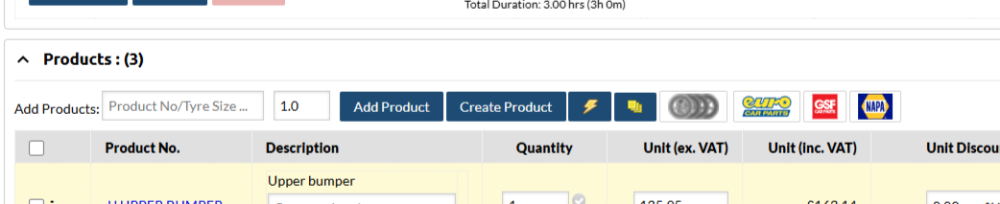

# Products and Invoicing

## Overview

This guide provides instructions on how to manage products within the job card system. Products are essential for tracking materials, parts, and services used in each job. Proper management ensures accurate job costing and inventory control.

### Add a Product

=== "Add an existing product."
    1. Open the job.
    2. Scroll down to "Products" section.
    3. Enter product number into "Add Products:"  
        (A dropdown will appear for all suppliers with that product number)
    4. Select the supplier.
    5. Edit the quantity and unit price.

=== "Create and add a new product."
    1. Open the job.
    2. Scroll down to "Products" section.
    3. Select "Create Product" 
    4. Fill in the 'add new product' form and "Add New Product"
        (See below for details on how to fill in the form)
    5. Edit the quantity and unit price as needed.

### Purchase orders
!!! note
    When you add a product to an invoice, a purchase order will be created for any 'tracked' products for that supplier. 
    
1. Check that the created purchase order matches your supplier invoice.
1. Input the invoice number/date, completing the purchase order, which will then be uploaded to sage accounting.

???+ tip "Tutorial"
    <iframe src="https://scribehow.com/embed/How_To_Add_Products_to_Job__pjsaYz65QzC0ZPsDs6oKfQ?as=video" width="934" height="640" allowfullscreen frameborder="0"></iframe>

### New Product Form Fields
`

<!-- ## Categories

This section explains how to manage product categories.

**Adding a Category:**

1.  **Navigate to Categories:** Go to the "Categories" section within product management.
2.  **Click "Add Category":** Click the button to add a new category.
3.  **Enter Category Name:** Provide a name for the new category.
4.  **Save:** Click "Save" to create the category.

**Editing a Category:**

1. **Locate Category:** Find the category you wish to edit.
2. **Click "Edit":** Click the edit icon or button associated with the category.
3. **Modify Name:** Change the category name as required.
4. **Save:** Click "Save" to apply changes.
**Deleting a Category**
1. **Locate Category:** Find the category you wish to delete.
2. **Click "Delete":** Click the delete icon or button associated with the category.
3. **Confirm Deletion** A confirmation message will be displayed to confirm that you want to delete the category.

## Subcategories

This section outlines the management of product subcategories.

**Adding a Subcategory:**

1.  **Navigate to Subcategories:** Go to the "Subcategories" section in product management.
2.  **Click "Add Subcategory":** Click the button to add a new subcategory.
3.  **Select Parent Category:** Choose the main category to which this subcategory belongs.
4.  **Enter Subcategory Name:** Provide a name for the subcategory.
5.  **Save:** Click "Save" to create the subcategory.

**Editing a Subcategory:**

1. **Locate Subcategory:** Find the subcategory you want to edit.
2. **Click "Edit":** Click the edit icon or button.
3. **Modify Details:** Change the parent category or the subcategory name.
4. **Save:** Click "Save".

**Deleting a Subcategory**
1. **Locate Subcategory:** Find the subcategory you wish to delete.
2. **Click "Delete":** Click the delete icon or button associated with the subcategory.
3. **Confirm Deletion** A confirmation message will be displayed to confirm that you want to delete the subcategory. -->