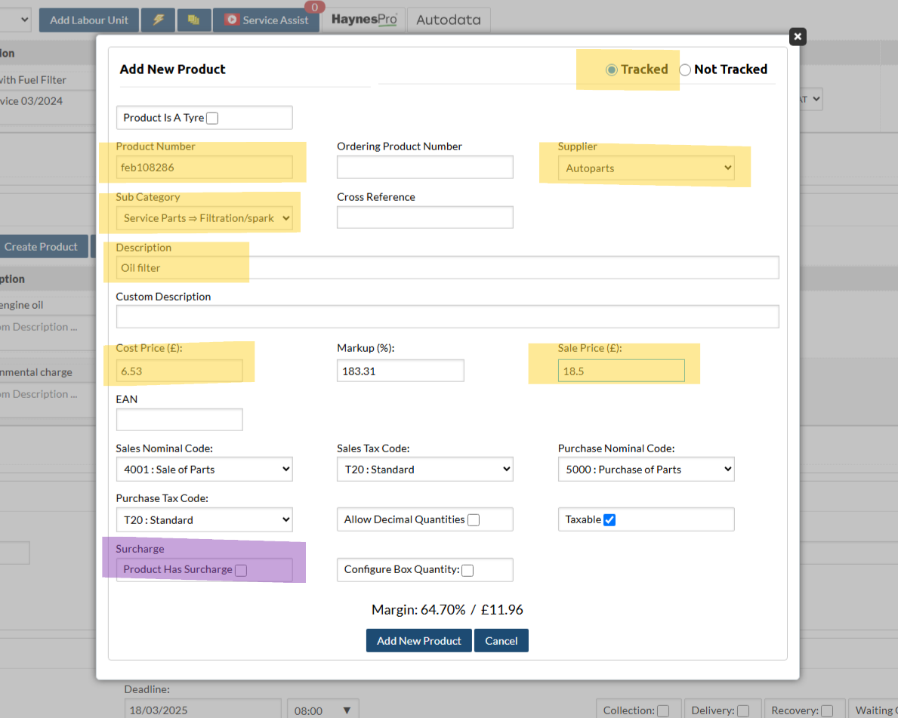
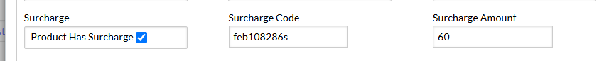

# Products and Invoicing

## Overview

This guide provides instructions on how to manage products within the job card system. Products are essential for tracking materials, parts, and services used in each job. Proper management ensures accurate job costing and inventory control.

### Add a Product

=== "Add an existing product."
    1. Open the job.
    2. Scroll down to "Products" section.
    3. Enter product number into "Add Products:"  
        (A dropdown will appear for all suppliers with that product number)
    4. Select the supplier.
    5. Edit the quantity and unit price.

=== "Create and add a new product."
    1. Open the job.
    2. Scroll down to "Products" section.
    3. Select "Create Product" 
    4. Fill in the 'add new product' form and "Add New Product"
        (See below for details on how to fill in the form)
    5. Edit the quantity and unit price as needed.

#### Create a 'tracked' product

!!! note
    **Yellow highlighted**: Inputs that will be updated each time you create a new tracked product.  
    **Purple highlighted**: Input will be checked when the product has a surcharge.
##### Fields
`Tracked`
:   Techman tracks the product when selected. This should be used wherever there is a purchased invoice.

`Product Number`
:   The product number associated with the part. This can be found on the supplier invoice (or just made up if the supplier doesn't provide one).

`Supplier`
:   The supplier of the part. If the supplier is not within the list then one must be created.

`Sub Category`
:   The sub category field will auto populate the sales and purchase nominal codes and tax codes found at the bottom of the form. For parts, find the most suitable category (if none can be found use parts > parts). There are categories for edge cases like outsourced work and small tools.

`Description`
:   The customer will see this description. Give a conscise description of the part that anyone can understand. ie. 'Front brake pads' instead of 'Front pads'. Specify the location of the parts, ie. 'Offside' or 'Nearside'.

`Custom Description`
:   A longer, more specific description if needed. Can be used for warranty information etc.

`Cost Price`
:   Price to use plus VAT

`Sale Price`
:   Sale price to customer plus VAT

'Sales and Tax Codes`
:   What sage will see

`Taxable`
:   Most things are taxable

`Surcharge`
:   Select this box when there is a surcharge and fill in the details, techman will create another product for the surcharge.  

When selected, 'Surcharge Code' and 'Surcharge Amount' appear (see image below).

+ **Surcharge Code**: Take the product number and add an 's' on the end. ie. if the product number is 'feb108286',  the surcharge is 'feb108286s'
+ **Surcharge Amount**: Enter the amount of the surcharge (plus VAT). This is found on the supplier invoice.

### Purchase orders
!!! note
    When you add a product to an invoice, a purchase order will be created for any 'tracked' products for that supplier. 
    
1. Check that the created purchase order matches your supplier invoice.
1. Input the invoice number/date, completing the purchase order, which will then be uploaded to sage accounting.

???+ tip "Tutorial"
    <iframe src="https://scribehow.com/embed/How_To_Add_Products_to_Job__pjsaYz65QzC0ZPsDs6oKfQ?as=video" width="934" height="640" allowfullscreen frameborder="0"></iframe>

### New Product Form Fields
`

<!-- ## Categories

This section explains how to manage product categories.

**Adding a Category:**

1.  **Navigate to Categories:** Go to the "Categories" section within product management.
2.  **Click "Add Category":** Click the button to add a new category.
3.  **Enter Category Name:** Provide a name for the new category.
4.  **Save:** Click "Save" to create the category.

**Editing a Category:**

1. **Locate Category:** Find the category you wish to edit.
2. **Click "Edit":** Click the edit icon or button associated with the category.
3. **Modify Name:** Change the category name as required.
4. **Save:** Click "Save" to apply changes.
**Deleting a Category**
1. **Locate Category:** Find the category you wish to delete.
2. **Click "Delete":** Click the delete icon or button associated with the category.
3. **Confirm Deletion** A confirmation message will be displayed to confirm that you want to delete the category.

## Subcategories

This section outlines the management of product subcategories.

**Adding a Subcategory:**

1.  **Navigate to Subcategories:** Go to the "Subcategories" section in product management.
2.  **Click "Add Subcategory":** Click the button to add a new subcategory.
3.  **Select Parent Category:** Choose the main category to which this subcategory belongs.
4.  **Enter Subcategory Name:** Provide a name for the subcategory.
5.  **Save:** Click "Save" to create the subcategory.

**Editing a Subcategory:**

1. **Locate Subcategory:** Find the subcategory you want to edit.
2. **Click "Edit":** Click the edit icon or button.
3. **Modify Details:** Change the parent category or the subcategory name.
4. **Save:** Click "Save".

**Deleting a Subcategory**
1. **Locate Subcategory:** Find the subcategory you wish to delete.
2. **Click "Delete":** Click the delete icon or button associated with the subcategory.
3. **Confirm Deletion** A confirmation message will be displayed to confirm that you want to delete the subcategory. -->