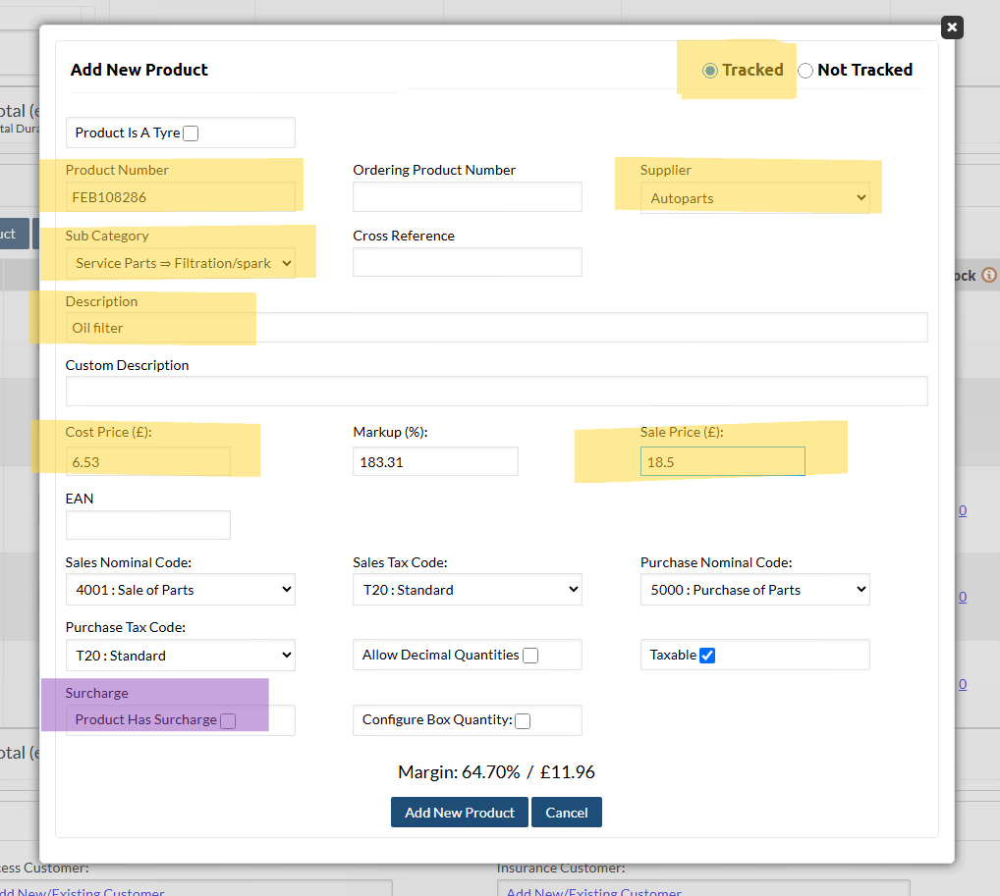

# Quick guide

## Invoice

### Create a New Job

??? tip "Tutorial"
    <iframe src="https://scribehow.com/embed/Creating_a_New_Job_Entry__2icJ1Qz0QU6FZF623sJwvQ?as=video" width="934" height="640" allowfullscreen frameborder="0"></iframe>

### Add Products

=== "Add a tracked product"

    ??? tip "Tutorial"
        <iframe src="https://scribehow.com/embed/How_To_Add_Products_to_Job__pjsaYz65QzC0ZPsDs6oKfQ?as=video" width="934" height="640" allowfullscreen frameborder="0"></iframe>

    ??? example "Screenshot"
        

=== "Add untracked product (placeholder)"
    You might need to add an "untracked product" (a placeholder) in situations where you don't have a purchase invoice. Here are some common use cases:

    * **Quoting:** Adding a temporary product entry while preparing a quote, before the actual purchase.
    * **Existing Stock:** Registering items already in stock that weren't acquired through a formal purchase invoice.

    ???+ abstract "Steps to Add an Untracked Product from a job"
        1. Scroll down to "Products" section.
        2. Click "Create Product"
        3. Select "Untracked Product" in top right hand corner.
        4. Enter a **product number**.
            * **Recommendation:** Prefix your product numbers with "JJ" (e.g., `JJ OIL FILTER` or `JJ WISHBONE`).
        5. Select the supplier as "J & J Commercials LTD".
        6. Fill in cost price, description and sale price fields.
        7. Create the product.

    !!! note
        * Even for untracked products, there must be a product number. You can make up any product number.
        * It is best to prefix the number with "JJ" ie. JJ "OIL FILTER" or "JJ WISHBONE", so that they can be easily found and reused.

### Send an invoice

=== "Generate and send an invoice"

    ???+ abstract "Steps to Generate and Send an Invoice"
        1. Enter vehicle mileage.
        2. Enter next MOT due date.
        1. Double check all labour units are correct:  
            - **Descriptions**
            - **Quantities**
            - **Technician**
        2. Double check all products are correct:
            - **All products present**
            - **Descriptions are clear to the customer**
            - **Quantities**
            - **All purchase orders have been created for the products**
        3. When you are sure everything is in order, click **""Generate Invoice""**, and follow any prompts.
        1. Hover over "Email" and select **"Itemised Invoice"** from the menu.
            - Select **"Invoice Confirmation"** from the template.
            - Check the customer email is correct, and send.

    ??? tip "Tutorial"
        <iframe src="https://scribehow.com/embed/Generate_and_Send_an_Invoice_to_Customer__ovOt3M6PT4qvFk1lgUzx3g?as=video" width="934" height="640" allowfullscreen frameborder="0"></iframe>

=== "Generate and send an invoice with a PO number"
    !!! note

        Only two customers require a PO number with their invoice:  

        - **Sheild Environmental**
        - **Shield Fire and Security**

    ???+ abstract "Steps to send an invoice with a PO number"
        1. Make sure the invoice has been double checked for errors.
        2. At the top of the job page, hover over "Email" and select **Itemised ProForma Invoice**
            - Select **"ProForma Invoice template"**
            - Check the email is to the transport management (Mark or Mia from Shield), and send
        3. The transport manager will reply with a purchase order and number.
        4. **Check the purchase order totals match the job totals.**
        5. Scroll down to the bottom of the page to **"Job Details"**
            - input the PO number into **"Customer Reference"**
        6. You can now **"Generate Invoice"**.
        7. Scroll down to "Customer Details". In the top right hand side of the box you will find "Notes".
            - Within the notes you will find the accounts email.
            - For shield it is ;purchaseledger@shieldenvironmental.co.uk
            - Copy this email and paste next to the transport managers email.
            - **Note:** Email addresses must be seperated by a semi-colon (;)
        8. Select **"Itemised Invoice"** from the template.
        9. Send the invoice.

    !!! note
        The accounts email can't be permanently associated with the shield account as they will 
        get all emails including reminders which they will not want.

